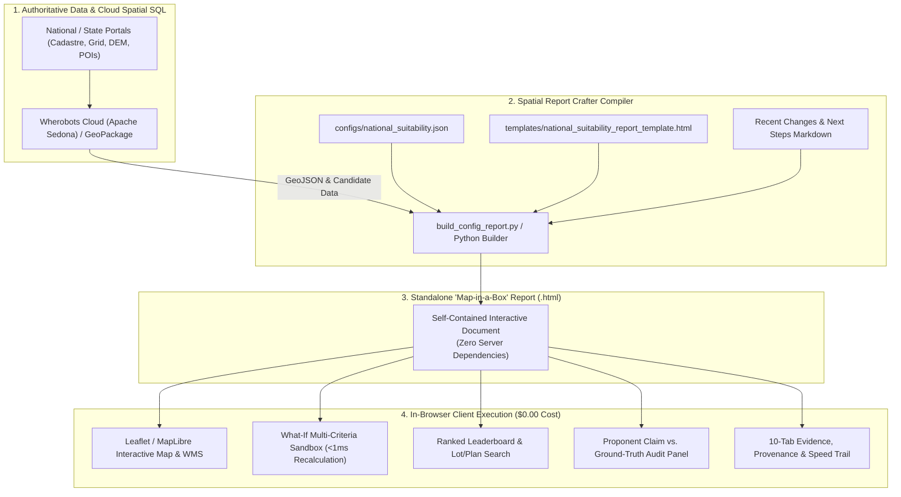

# Spatial Report Crafter 🗺️📦

**Spatial Report Crafter** is an enterprise-grade toolkit and architectural method for building **'Map-in-a-Box'** interactive spatial HTML reports, multi-criteria decision analysis (MCDA) engines, and geospatial audit dashboards.

It compiles massive spatial datasets (queried across millions of geometries via **Wherobots Cloud / Apache Sedona** or local **GeoPackages**), live government WMS/REST feeds, and multi-criteria constraint models into a **single, zero-dependency, standalone HTML document** that runs entirely in any modern web browser with **$0.00 ongoing cloud compute cost**.

---

## 🚀 The 'Map-in-a-Box' Philosophy

Traditional geospatial reporting suffers from a fundamental tradeoff: either deliver static PDF/Word maps that cannot be interrogated, or host heavy web GIS servers (GeoServer, ArcGIS Enterprise, Mapbox GL) that require costly running infrastructure, cloud licenses, and backend database connections.

**Spatial Report Crafter solves this via client-side compilation:**
- **Zero Cloud Compute Latency**: The heavy spatial work (topological buffers, `ST_Difference` masks, contour winding distances) is computed once on cloud spatial engines (Wherobots/Sedona) and embedded as structured GeoJSON/JSON payloads.
- **Sub-Millisecond Slider Interactivity**: Multi-criteria weight sliders and scenario toggles run 100% in-browser via JavaScript, re-scoring candidates and updating leaderboards in **< 1 millisecond** without server round-trips.
- **Complete Open Evidence Trail**: Integrates interactive maps, live transmission feeds, side-by-side ground-truth audit panels, data provenance tables, and reproducible SQL trails into a single shareable document.



---

## 🛠️ The 4-Stage Method for Creating Spatial HTML Reports

### Stage 1: Spatial Data Extraction & Database Ingestion
1. **Coordinate Reference System (CRS) Normalization**: Standardize all layers into an official metric projected CRS (e.g. `EPSG:7856` GDA2020 / MGA Zone 56 or `EPSG:3112` Geoscience Australia Lambert) for accurate distance buffers and area calculations. Keep output display geometries in `EPSG:4326` (WGS84).
2. **Topology Verification & Repair**: Always sanitize geometries with `ST_MakeValid` and filter out degenerate geometries prior to aggregation.
3. **Data Fingerprinting & Memoization**: Use cryptographic hashing (ETags, GeoParquet file hashes, Iceberg snapshot IDs) to skip re-ingesting untouched spatial layers.

### Stage 2: Decoupled Incremental Spatial Processing
To optimize compute costs and allow rapid parameter iteration:
- **Decouple Heavy Geometry from Lightweight Scoring**: Execute topological buffering (30m riparian, 20m pipelines), polygon difference overlays (`ST_Difference`), and network winding distance matrices once.
- **Downstream Scoring**: Evaluate mathematical decay curves ($S_{\text{power}}$, $S_{\text{sensitive}}$, $S_{\text{water}}$) and continuous sigmoidal functions independently without re-triggering heavy spatial joins:
  $$S_{\text{sensitive}}(d) = \frac{1}{1 + e^{-k(d - d_0)}}$$

### Stage 3: Template-Driven Report Assembly
The Python report builder (`scripts/build_config_report.py`) dynamically compiles the final HTML document:
1. **Config-Driven Query Execution**: Maps SQL queries in `configs/*.json` to specific GeoJSON layer placeholders.
2. **Dynamic Metadata & Volume Ingestion**: Queries database row counts dynamically to build the provenance evidence table.
3. **Markdown Documentation Folding**: Automatically converts `walkthrough.md`, `next_steps.md`, or `recent_changes.md` into integrated tabs within the report.
4. **Escaped Template Safety**: Strictly handles multiline string escapes (e.g. `\\n`) to prevent JavaScript template syntax errors.

### Stage 4: Zero-Cost Client-Side Simulation & Analytics
1. **Interactive What-If Sandbox**: In-browser JavaScript sliders dynamically re-normalize weights to 1.0 and re-evaluate composite candidate scores in `< 1ms`.
2. **Scenario Toggles**: Instant hazard / easement switches (e.g., TSF Dam Safety) swap polygon layers and update net developable pad statistics instantly.
3. **GeoLibre & DuckDB-WASM Ready**: Output GeoParquet layers can be queried serverless via [opengeos/GeoLibre](https://github.com/opengeos/GeoLibre) using DuckDB-WASM over HTTP byte-range requests.

---

## 📋 Core Dashboard Component Architecture

A complete **Spatial Report Crafter** document incorporates the following standard modules:

| Component | Purpose & Features |
| :--- | :--- |
| **1. Header & KPI Metric Strip** | Displays high-level KPIs with CSS hover tooltips and accessible `ℹ` footnote links (e.g. Candidates, Geometries, Join Speed, Batch Compute Cost). |
| **2. Multi-Factor What-If Sandbox** | Real-time sliders for Power, Recycled Water, Sensitive Setbacks, and Parcel Size, with interactive scenario toggle switches. |
| **3. Interactive WebGL Map** | Leaflet/MapLibre map with 75% dark slate background mask, 0.0 transparent focus symbology, draggable floating HUD popups, and live WMS/ArcGIS feeds. |
| **4. Ranked Leaderboard & Search** | Sortable table with dynamic score bars, locality filters, and live Lot/Plan cadastre search (e.g. `101//DP755262`). Clicking rows synchronously highlights map features without viewport jumps. |
| **5. Live Dynamic Cost Worksheet** | Interactive proposal and deliverables calculation table with real-time recalculations (`hours × rate`), category subtotals, grand totals, row reordering (`▲`/`▼`), and add/delete actions. |
| **6. Architectural Lessons Learned** | Structured interactive review cards documenting decoupled architecture, topological contiguity solvers, and time & cost protocols. |
| **7. Proponent Audit Panel** | Side-by-side ground-truth audit verifying net developable pad space (deducting riparian, pipeline, slope >5%), topological network routing (1.32x winding factor), and thermodynamic heat drop. |
| **8. Multi-Tab Evidence Trail** | 10 integrated tabs: State Benchmarking, Regional Aggregates, Data Sources & Volumes, Lakehouse Storage Directory Tree, Table Footprints, Whitepapers, Speed Mechanics, Calculations & SQL Trail, Recent Changes, and Next Steps. |

---

## 💡 Key Architectural Lessons Learned & Engineering Innovations

Across enterprise spatial and commercial districting projects, **Spatial Report Crafter** incorporates six core architectural lessons:

### 1. Decoupled Architecture: Standalone Deliverables vs. Enterprise Platform
Traditional geospatial projects suffer from forced tradeoffs between static non-interactive PDFs and costly, slow-to-deploy enterprise GIS web servers (GeoServer, ArcGIS Enterprise, Mapbox Studio).  
**The Solution:** Decouple immediate analytical deliverables from long-term enterprise GIS hosting:
- **Spatial Report Crafter ("Map in a Box"):** Standalone, zero-server WebGL HTML deliverables generated for instant stakeholder review, QA validation, and interactive what-if modeling. Runs 100% in client browsers with **$0.00 recurring cloud query cost**.
- **Enterprise GIS Platform (e.g., Mangoesmapping GEM):** Role-based multi-user management, layer publishing, field survey data collection, and ongoing operational asset tracking.

```
+-----------------------------------------------------------------------------------+
|                           DECOUPLED SOLUTION ARCHITECTURE                         |
|                                                                                   |
|   ┌─────────────────────────────────────────┐     ┌───────────────────────────┐   |
|   │   SPATIAL REPORT CRAFTER (INNOVATION)   │     │  ENTERPRISE PLATFORM      │   |
|   ├─────────────────────────────────────────┤     ├───────────────────────────┤   |
|   │ • Zero-Server Standalone WebGL HTML     │ ──► │ • Multi-User Permissions  │   |
|   │ • Sub-Millisecond Multi-Million Sliders │     │ • Long-Term Asset Hosting │   |
|   │ • Topological Contiguity Solver         │     │ • Field Survey Sync       │   |
|   │ • Live Interactive Cost Worksheet       │     │ • Enterprise GIS Layering │   |
|   └─────────────────────────────────────────┘     └───────────────────────────┘   |
+-----------------------------------------------------------------------------------+
```

### 2. Strict Topological Contiguity & Island-Bridge Routing
Naive spatial clustering based purely on centroid Euclidean distance or travel-time produces non-contiguous territory fragments and isolated spatial islands across water bodies or mountain ranges.  
**The Solution:**
- **Boundary-Edge Adjacency Graphs:** Polygons can only merge into a seed territory if they share a physical boundary edge (`ST_Touches` / polygon adjacency graph).
- **Island-Bridge Routing:** Coastal islands and peninsulas are mapped via road network bridge/ferry paths rather than line-of-sight distance.
- **Automated Contiguity Certification:** Verification tests `len(shapely.ops.polygonize(unary_union)) == 1` for every territory before report rendering.

### 3. Zero-Server WebGL Client Shaders (< 1 ms Reactive Sliders)
Running spatial queries or demographic aggregations against cloud databases for every slider movement introduces unacceptable latency (500ms–2s) and high cloud query bills.  
**The Solution:** Compute spatial joins once during compilation and embed pre-aggregated statistics into client-side integer bitmasks and GPU shaders. Slider adjustments recalculate composite scores and redraw millions of points in **< 1 millisecond** directly on user GPUs.

### 4. High-Contrast 75% Dark Mask Symbology
When highlighting specific candidate sites or franchise zones, typical opaque choropleth maps obscure underlying satellite imagery and street grids.  
**The Solution:** Apply a **0.0 fill opacity (100% transparent interior)** with a vibrant cyan border (`#38bdf8`) on active selections, paired with a **75% dark slate grey mask (`#64748b`, 0.75 opacity)** on background areas.

### 5. Screen-Space Detachable Draggable HUD Popups
Standard map popups are anchored to geographic coordinates, meaning panning or zooming the map moves the scorecard off-screen.  
**The Solution:** When a user drags a popup, it detaches from map coordinate tracking into an absolute screen-space floating HUD panel that stays fixed on screen while the user freely navigates the map.

### 6. Standardized Time & Cost Tracking Protocol (TCTP)
AI-assisted and automated spatial pipelines require radical cost accountability.  
**The Solution:** Maintain a continuous, auditable [`TIME_AND_COST_LOG.md`](docs/TIME_AND_COST_TRACKING_STANDARD.md) tracking human review time, AI machine orchestration, and cloud VM/GPU compute hours.

---

## 🎛️ New Turnkey Options in `SpatialReportCrafter`

The `SpatialReportCrafter` Python SDK exposes modular options to embed dynamic cost worksheets and architectural review cards:

| Parameter | Type | Default | Description |
| :--- | :--- | :--- | :--- |
| `include_cost_worksheet` | `bool` | `False` | Embeds a live, reactive cost & deliverables worksheet with real-time recalculations (`hours × rate`), row reordering (`▲`/`▼`), item additions (`➕`), and deletions (`✕`). |
| `include_lessons_learned` | `bool` | `False` | Embeds structured architectural lessons learned cards documenting decoupled architecture, graph contiguity, and zero-server shaders. |
| `mask_opacity` | `float` | `0.75` | Controls background grey mask opacity (e.g. `0.75` for 75% dark suppression). |
| `mask_color` | `str` | `"#64748b"` | Hex color for the non-selected spatial background mask. |
| `highlight_color` | `str` | `"#38bdf8"` | Accent color for selected territory boundaries and active controls. |
| `worksheet_config` | `dict` | `None` | Custom categories, deliverable line items, and partner platform quote placeholders. |
| `lessons_learned_config`| `dict` | `None` | Custom lessons, badges, and architectural insights. |

### Complete Python API Example:

```python
from spatial_report_crafter import SpatialReportCrafter

# Initialize with turnkey live worksheet and architectural lessons options
crafter = SpatialReportCrafter(
    title="National Siting & Districting Suite",
    subtitle="Zero-Server WebGL Spatial Report Crafter",
    mask_opacity=0.75,
    highlight_color="#38bdf8",
    include_cost_worksheet=True,      # Enables live dynamic calculation worksheet
    include_lessons_learned=True       # Enables architectural lessons learned tab
)

# Compiles everything into a single standalone zero-server WebGL HTML suite
crafter.generate_html_report(
    territories_gdf=territories,
    postcodes_gdf=postcodes,
    seeds_gdf=seeds,
    catchments_gdf=catchments,
    output_html_path="docs/districting_suite.html",
    summary_stats={"total_candidates": 150}
)
```

---

## 📚 Standards & Architecture References

- **[Architectural Lessons Learned & Mechanics](docs/LESSONS_LEARNED.md)**: Comprehensive deep dive into decoupled architecture, graph contiguity solvers, and client shaders.
- **[Time & Cost Tracking Protocol Standard](docs/TIME_AND_COST_TRACKING_STANDARD.md)**: Mandatory repository tracking standard and proposal live worksheet integration guidelines.

---

## ⚙️ Configuration Schema (`configs/national_suitability.json`)

```json
{
  "report_title": "National Siting Suitability Report",
  "project_crs": "EPSG:7856",
  "wherobots_queries": {
    "main_suitability": "SELECT * FROM org_catalog.fgsdb.candidate_suitability"
  },
  "local_vector_layers": [
    {
      "name": "Net Developable Pad Space",
      "placeholder": "__NET_DEVELOPABLE_GEOJSON__",
      "query": "SELECT precinct_key, net_developable_geom FROM org_catalog.fgsdb.net_developable_zones",
      "properties_map": { "precinct_key": 0 },
      "geometry_index": 1
    }
  ],
  "wms_services": [
    {
      "name": "GA National Transmission Grid",
      "url": "https://services.ga.gov.au/gis/rest/services/Electricity_Infrastructure/MapServer",
      "type": "esri-dynamic"
    }
  ]
}
```

---

## 🏆 Production References & Examples

- **Showcase Implementation**: [hunter_spatial_crafter](https://github.com/GetBack2Basics/hunter_spatial_crafter) — National AI Data Center Siting Engine querying 15.91M geometries.
- **Live Interactive Demo**: [national-suitability-report.vercel.app](https://national-suitability-report.vercel.app)
- **Engineering Playbook**: [wherobots_antigravity_playbook.md](https://github.com/GetBack2Basics/CheatSheets/blob/main/wherobots_antigravity_playbook.md)
- **Word/DOCX Generation**: [Spatial_Document_Crafter](https://github.com/GetBack2Basics/Spatial_Document_Crafter)
- **Open-Source Web Platform**: [opengeos/GeoLibre](https://github.com/opengeos/GeoLibre)

---

## 📜 License
MIT License — Copyright (c) 2026 George Chandeep Corea (GetBack2Basics).

